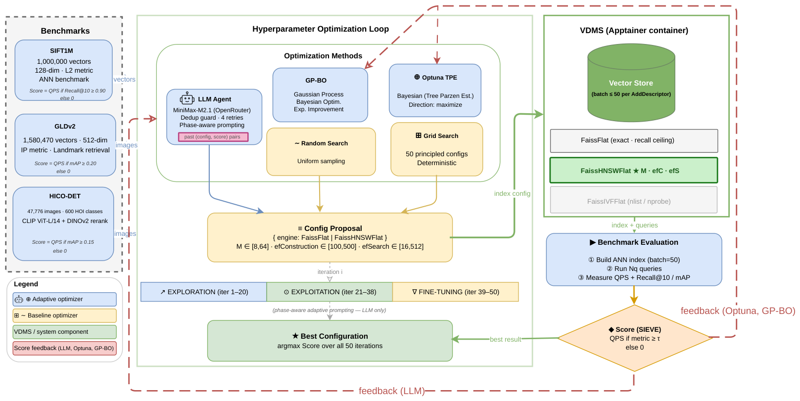

# Agentic VDMS — Supplementary Materials

**Paper:** *LLM-Guided ANN Index Optimization for Efficient Human-Object Interaction Retrieval*
**Venue:** VLDB 2027 submission



> **Figure:** Five optimizer methods propose VDMS configurations over N=50 iterations.
> Adaptive methods (LLM Agent, Optuna TPE, GP-BO) receive SIEVE score feedback;
> Grid and Random Search do not.

---

## Repository Structure

```
├── src/                         # Python source code
│   ├── hico_det/
│   │   ├── hico_agent_optimizer.py      # Main LLM agent optimizer (all methods)
│   │   ├── centroid_bias_validation.py  # Text-query centroid geometry proof
│   │   ├── extract_hico_det.py          # HICO-DET dataset preparation
│   │   ├── extract_hico_text_queries.py # HOI text query construction
│   │   └── run_hico_system_baselines.py # UniIR / FaissFlat baselines
│   ├── gldv2/
│   │   ├── gldv2_agent_optimizer.py     # GLDv2 optimizer (cross-domain)
│   │   ├── extract_gldv2_features.py    # CLIP + DINOv2 feature extraction
│   │   └── run_gldv2_system_baselines.py
│   └── sift1m/
│       └── sift1m_agent_optimizer.py    # SIFT1M optimizer (pure ANN)
│
├── experiments/                 # SLURM scripts to reproduce every run
│   ├── hico_det/
│   │   ├── run_llm_seed{42,99,200}.sh         # LLM agent (3 seeds)
│   │   ├── run_gpbo_seed{42,99,200}.sh        # GP-BO baseline
│   │   ├── run_optuna_seed{42,99,200}.sh      # Optuna TPE baseline
│   │   ├── run_random_seed{42,99,200}.sh      # Random Search baseline
│   │   ├── run_grid.sh                        # Grid Search (1 run)
│   │   ├── run_ablation_no_history_seed{42,99,200}.sh
│   │   ├── run_ablation_no_phases_seed{42,99,200}.sh
│   │   ├── run_ablation_no_history_no_phases_seed{42,99,200}.sh
│   │   ├── run_qds_seed{42,99,200}.sh         # Query Difficulty-weighted objective
│   │   ├── run_backbone_gpt4omini_seed42.sh   # GPT-4o-mini backbone ablation
│   │   └── run_backbone_llama_seed42.sh       # Llama-3.3-70B backbone ablation
│   ├── gldv2/
│   │   └── run_{llm,gpbo,optuna,random,grid}_seed42.sh
│   └── sift1m/
│       └── run_{llm,gpbo,optuna,random,grid}_seed42.sh
│
├── results/                     # Canonical JSON result files
│   ├── hico_det/
│   │   ├── llm/seed{42,99,200}.json
│   │   ├── gpbo/seed{42,99,200}.json
│   │   ├── optuna/seed{42,99,200}.json
│   │   ├── random/seed{42,99,200}.json
│   │   ├── grid/seed42.json
│   │   ├── ablations/no_history_seed{42,99,200}.json
│   │   ├── ablations/no_phases_seed{42,99,200}.json
│   │   ├── ablations/no_history_no_phases_seed{42,99,200}.json
│   │   ├── qds/seed{42,99,200}.json
│   │   ├── backbone/gpt4o_mini_seed42.json
│   │   ├── backbone/llama_seed42.json
│   │   └── system_baselines.json
│   ├── gldv2/{llm,gpbo,optuna,random,grid}/seed42.json
│   └── sift1m/{llm,gpbo,optuna,random,grid}/seed42.json
│
└── requirements.txt
```

---

## Setup

### Prerequisites
- Python 3.12
- NVIDIA GPU (tested on A40, CUDA 11.8)
- [Intel VDMS](https://github.com/IntelLabs/vdms) (via Apptainer container)
- OpenRouter API key (for LLM agent runs)

### Install dependencies
```bash
pip install -r requirements.txt
```

### Data preparation (HICO-DET)
```bash
python src/hico_det/extract_hico_det.py --data-dir /path/to/hico_det
python src/hico_det/extract_hico_text_queries.py --data-dir /path/to/hico_det
```

---

## Reproducing Results

Set your OpenRouter API key before running any LLM experiment:
```bash
export OPENROUTER_API_KEY="your-key-here"
```

Submit a SLURM job (example — LLM agent on HICO-DET, seed 42):
```bash
sbatch experiments/hico_det/run_llm_seed42.sh
```

Each script writes its result JSON to a path specified by `OUTPUT` inside the script. To reproduce the exact paper numbers, run all three seeds and average the `best_score` field from each output JSON.

---

## Result Format

Each JSON result file contains:
```json
{
  "summary": {
    "best_score": 300.5,
    "best_map": 0.160,
    "best_qps": 300.5,
    "best_config": { ... },
    "iterations_used": 50
  },
  "results": [ ... ]
}
```

The **SIEVE score** = `best_qps` when `best_map >= τ` (τ = 0.15 for HICO-DET/GLDv2, τ = 0.90 for SIFT1M), else 0. All canonical results in `results/` already meet the threshold.

---

## Key Results (Table 2 in paper)

| Method       | HICO-DET Score (QPS) | GLDv2 Score | SIFT1M Score |
|--------------|----------------------|-------------|--------------|
| LLM Agent    | **300.3** (±0.3)     | **276.3**   | **1175.0**   |
| Optuna TPE   | 225.2                | 273.0       | 1163.5       |
| GP-BO        | 199.3                | 77.6        | 471.4        |
| Grid Search  | 183.0                | 273.0       | 1174.4       |
| Random       | 111.4                | 256.0       | 1160.4       |

Score = QPS if mAP ≥ τ, else 0 (SIEVE objective).
HICO-DET means are over 3 seeds (42, 99, 200); GLDv2 and SIFT1M are seed 42.

Phase boundary sensitivity (t_exp/t_expl): all variants within ±0.53% of default, confirming robustness.
